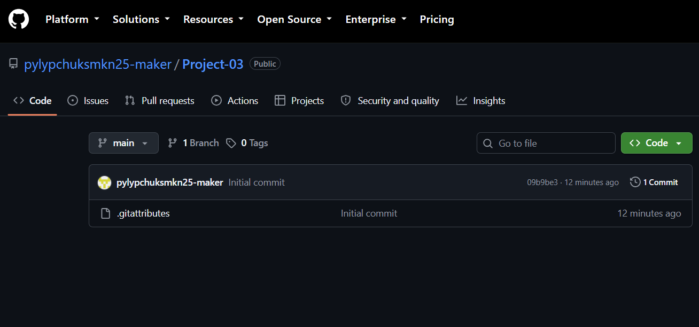

# Лабороторна робота №3
Виконання практичної роботи. esrdtfyui.

## Вставлення
'''bash
git clone https://github.com/pylypchuksmkn25-maker/Project-03.git'''

## Використання
Відкрийте файл index.html у будь-якому браузері

## Використані технології
| Технологія | Роль у проєкті | Призначення |
| :--- | :--- | :--- |
| HTML5 | Верстка | Створення структури сторінки |
| CSS3 | Стилізація | Налаштування дизайну та блоків |
| Git | Контроль версій | Збереження історії змін проєкту |

## Зображення проєкту

## Ліцензія
MIT License

## Автори
Пилипчук Софія. КН-2/1
https://github.com/pylypchuksmkn25-maker

